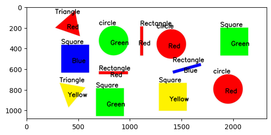

# MIA-Task11

## final output:

## Algorithms:
### for shape detection:
1. mask the edges of each shape
2. mak an array of all points in the mask
3. simpilfy the array to only include the corners
4. count the corners and decide the shape

### for color detection:
1. convert the image to HSV
2. set the lower and higher HSV of each color
3. calculate the center of each shape
4. compare the HSV of the center pixel with red, blue, green and yellow to decide the color